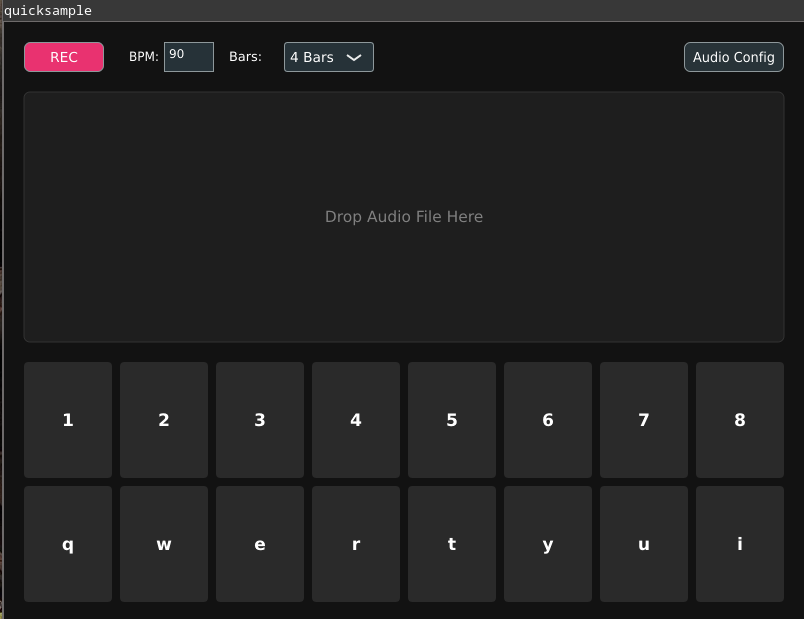

# quicksample

Minimalist audio sampler built in C++ with JUCE. Chop samples & bounce to an audio file by recording with a built in metronome & bar counter. Inspired by the Serato Sample workflow



## Features

- Drag & drop file loading (supports WAV, MP3, and AIFF)
- Instantly creates 16 equally sized chops & maps to keyboard controlled pads
- Waveform visualization with zoom & scroll
- Modify chops
    - Drag to adjust with the mouse
    - Left or right arrow keys to nudge the marker +-10ms
- Resample your recording directly to a WAV file
- 4 beat count-in metronome
- Adjust recording BPM & bar length
- Modern UI

## Controls

| Action | Input |
| -------------- | --------------- |
| Play pads 1-8 | Keys 1-8 |
| Play pads 9-16 | Keys q, w, e, r, t, y, u, i |
| Stop playback / recording | Spacebar |
| Record/stop | Ctrl + R |
| Zoom waveform | Mouse scroll wheel |
| Select chop | Press pad key |
| Move slice (fine) | Left/right arrow keys (with chop selected) |
| Move slice (coarse) | Click & drag marker |

## Installation

Go to the [releases](https://github.com/ferretcode/quicksample/releases) page (or the latest GitHub actions ratifacts) to download the latest installer bundle

- Windows: `.zip` portable or `.exe` installer
- Linux: `.deb` (Debian/Ubuntu) or `.tar.gz` (generic)

## Use With Tiling Window Managers (i3/sway)

- Force window floating in your configuration:

```i3
for_window [class="^quicksample$"] floating enable
```

## Building from Source

### Prerequisites

- `CMake` (3.15+)
- `C++17` compiler (GCC [recommended]/Clang/MSVC)

#### Linux

1. Install dependencies

```bash
# Ubuntu/Debian
sudo apt install build-essential cmake libasound2-dev libjack-jackd2-dev \
    ladspa-sdk libcurl4-openssl-dev libfreetype6-dev libx11-dev \
    libxcomposite-dev libxcursor-dev libxext-dev libxinerama-dev \
    libxrandr-dev libxrender-dev libwebkit2gtk-4.1-dev libgtk-3-dev

# Arch
sudo pacman -S base-devel cmake alsa-lib jack2 curl gtk3 webkit2gtk pkgconf
```

2. Build

```bash
mkdir build && cd build
cmake .. -DCMAKE_BUILD_TYPE=Release
cmake --build .
```

#### Windows

1. Install dependencies
    - Install VS 2022
    - Install CMake
    - Install `vcpkg` and install cURL: `vcpkg install curl:x64-windows`
2. Build

```bash
cmake -B build -DCMAKE_TOOLCHAIN_FILE="C:/path/to/vcpkg/scripts/buildsystems/vcpkg.cmake"
cmake --build build --config Release
```
